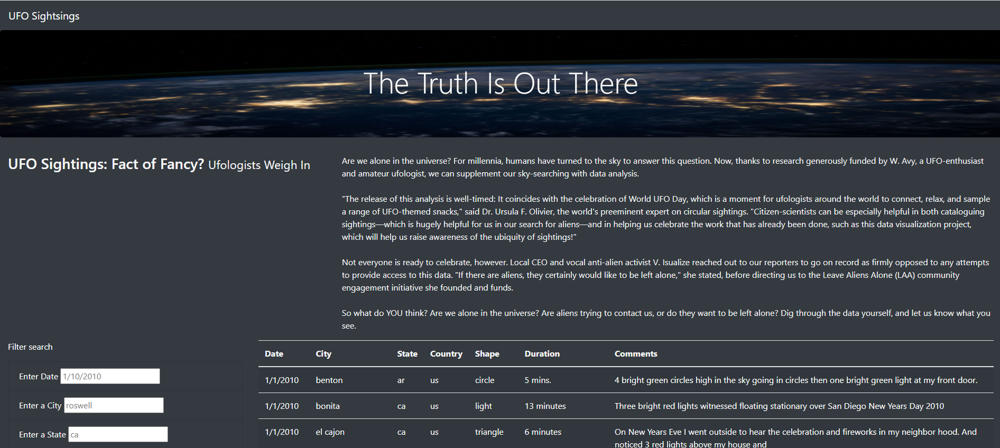
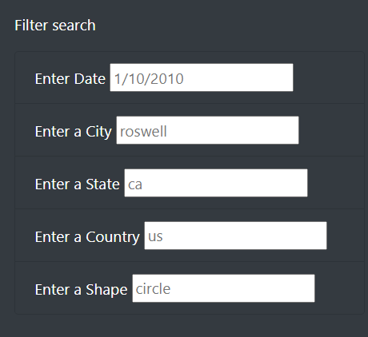

# UFO Analysis

## Objective

To build a webpage and dynamic table in which users are able to filter the UFO sightsings data by multiple criteria at the same time (i.e. date, city, state, country and shape).

## Results

Our UFO webpage is the following:

In order to conduct a search has to go to the "Filter search" section and enter the filter data requirements in the shown format, for example, date has to be incorporated in the "mm/dd/yyyy" format. In addition to date, we can also filter by city, state, country and shape.

The filtering criteria is the following one:

## Summary

1. Webpage drawback: Filter search format is not smart enough, if data is not incorporated exactly as in the suggested format, no results will be shown.
2. Recommendations:
   i) Incorporate summary and consolidated data to view key highlights in a more visually attractive setting
   ii) For country and shape filters incorporate a "drop-down" like list button to havea grasp of all available countries and shapes
